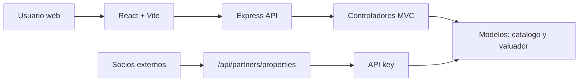

# Arquitectura

## Modelo-Vista-Controlador desacoplado

El backend usa MVC sobre Express:

- Modelos: `server/models/` contiene acceso al catalogo y algoritmo de precio.
- Controladores: `server/controllers/` transforma solicitudes HTTP en operaciones de negocio.
- Rutas: `server/routes/` publica los contratos REST.
- Vista: `src/` implementa la interfaz React como cliente desacoplado.

El cliente consume `/api/*` por HTTP. En desarrollo Vite usa proxy hacia `http://127.0.0.1:3000`; en produccion Express sirve `dist/` y la API desde el mismo dominio.

## Componentes reactivos

- `FilterPanel`: filtros de busqueda y geolocalizacion.
- `PropertyCard`: ficha repetible de inmueble.
- `MapPanel`: Google Maps API o mapa demo.
- `EstimatorPanel`: formulario de valuacion con CSRF.
- `SellerProfile`: perfil vendedor para publicar inmuebles propios.
- `MarketStats`: indicadores agregados del catalogo.

## Datos y valuacion

El valuador toma zona, tipo, superficie, recamaras, Baños, estacionamientos, antiguedad y amenidades. Calcula precio de venta por m2, ajusta por factores locales y deriva renta mensual con rendimiento por zona.
